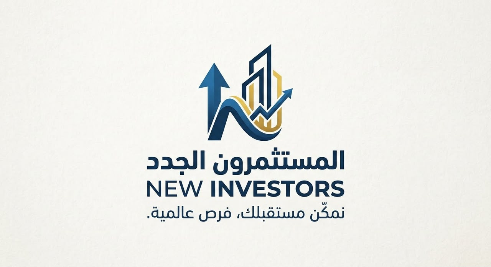

# New Investors | المستثمرون الجدد



**New Investors (المستثمرون الجدد)** is a premium, localized real estate investment and development platform built for the Libyan market. It showcases high-value commercial and residential real estate development projects, providing a stunning user experience optimized for both Arabic (RTL) and English (LTR) readers.

## 🚀 Technology Stack

This platform is built using modern, bleeding-edge web technologies to ensure maximum performance, incredible SEO, and a premium UX.

- **Framework**: [Next.js 15+](https://nextjs.org/) (React Server Components, App Router)
- **Styling**: [Tailwind CSS](https://tailwindcss.com/)
- **Animations**: [Framer Motion](https://www.framer.com/motion/)
- **Internationalization (i18n)**: [next-intl](https://next-intl-docs.vercel.app/)
- **Icons**: [Lucide React](https://lucide.dev/)
- **Theming**: `next-themes` (Dark/Light mode)
- **Typography**: Optimized Google Fonts (Plus Jakarta Sans, Outfit, Alexandria, Geist Mono)

## ✨ Core Features

- **True Bi-directional UI**: Flawless switching between Arabic (Right-to-Left) and English (Left-to-Right).
- **Cinematic Dark Mode**: Integrated deep navy and gold branding dynamically linked to user preference.
- **Micro-interactions**: Hardware-accelerated hover effects, interactive cards, and page transition skeletons.
- **SEO Optimized**: Dynamic OpenGraph images, Metadata generation, automated sitemap.xml, and strictly governed robots.txt policies blocking AI scrapers.
- **Dynamic Contact Hub**: Integrated `mailto:` APIs formatting complex leads natively into the user's email client.

## 🛠️ Local Development

To run this project locally on your machine:

1. **Clone the repository** (Requires access rights)
2. **Install Dependencies**
   ```bash
   npm install
   ```
3. **Run the Development Server**
   ```bash
   npm run dev
   ```
4. **Access the application**
   Open [http://localhost:3000](http://localhost:3000) in your browser.

## 📁 Architecture Overview

- `/src/app/[locale]/`: Contains all page routes configured for internationalization.
- `/src/components/`: Reusable, modular UI blocks (Header, Hero, Sectors, Footer, ContactForm).
- `/messages/`: Contains `en.json` and `ar.json` dictionary files acting as the single source of truth for all text in the app.
- `/public/`: Hosts static assets, brand logos, imagery, and the SEO XML files.

## ⚖️ Legal & Licensing

This software is strictly proprietary. Unauthorized copying of this repository, via any medium, is strictly prohibited. See the `LICENSE` file for more details.

**Developed by**: ZeroNux Studio  
**Domain**: [https://newinvestgroup.ly](https://newinvestgroup.ly)
